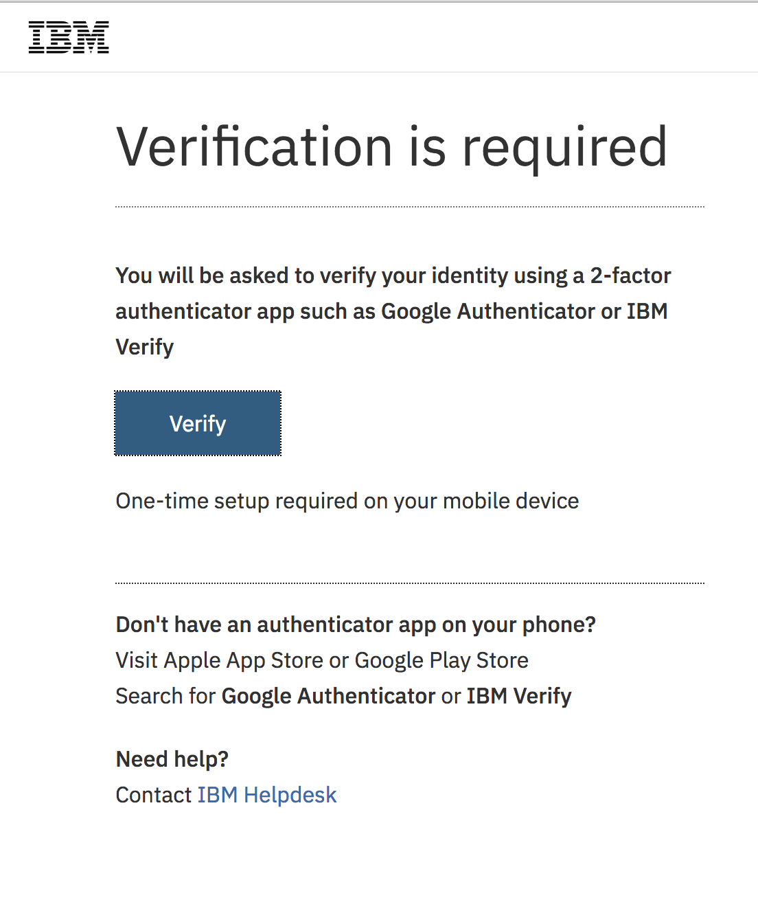
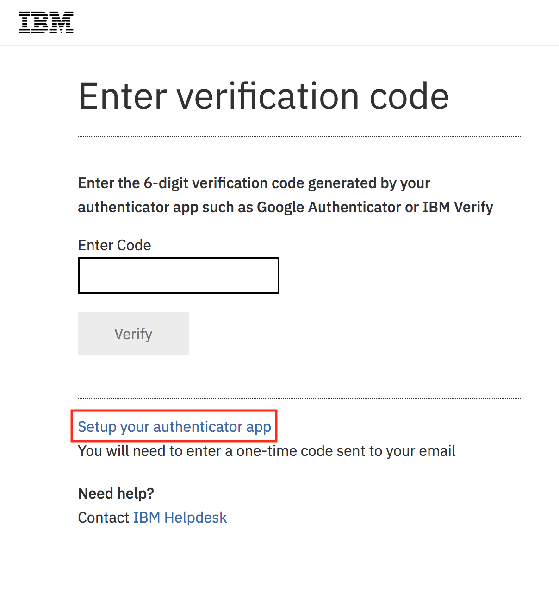
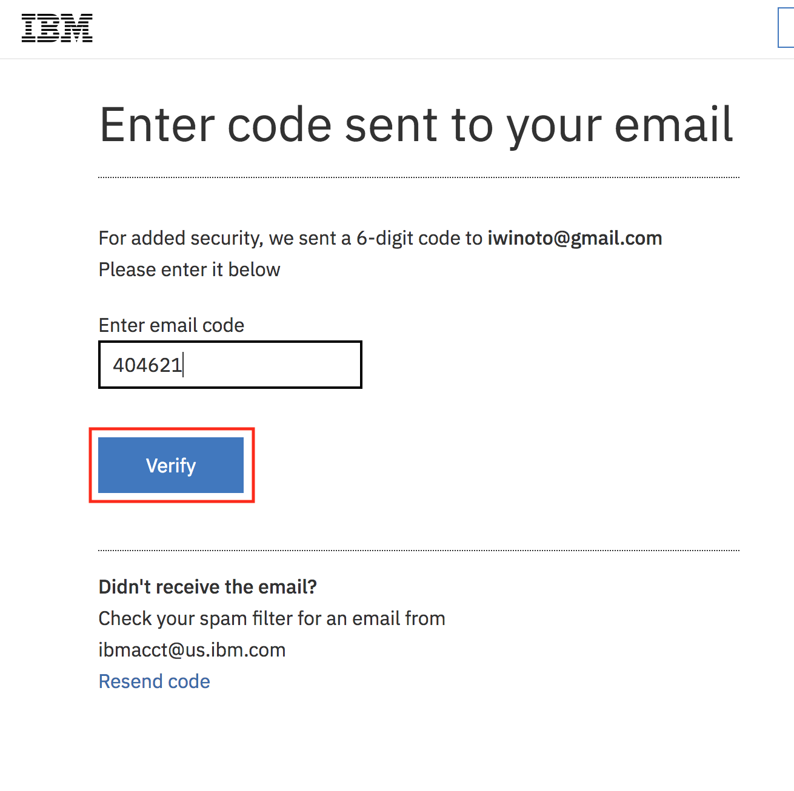
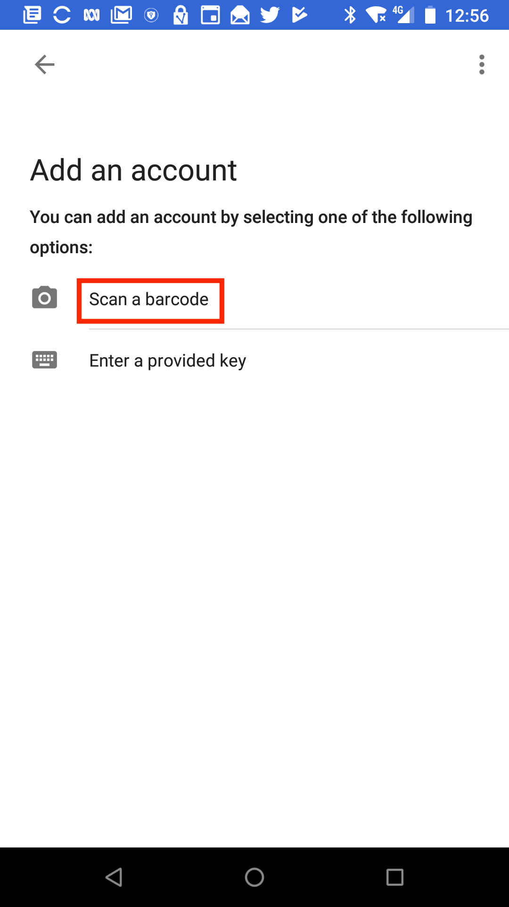
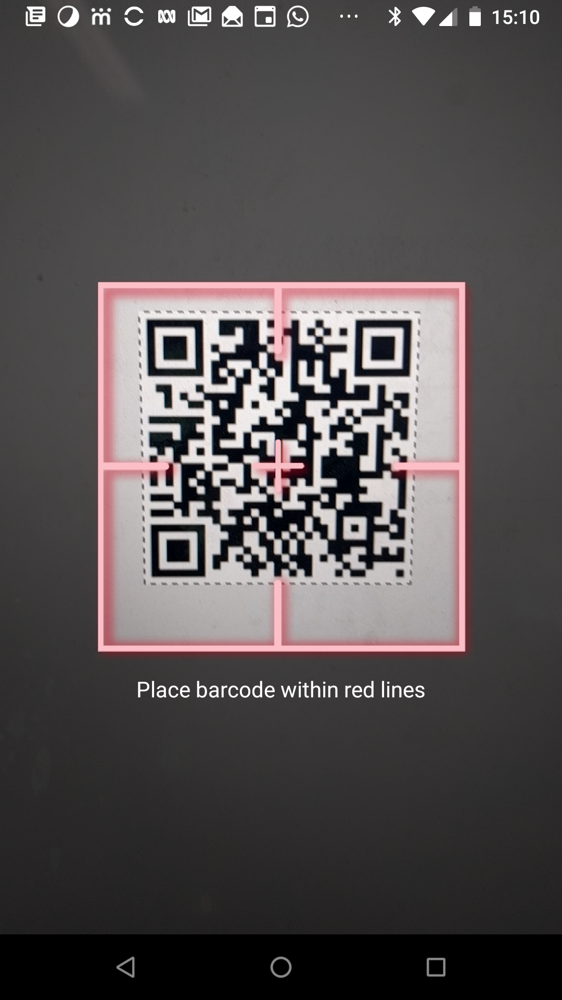

---

copyright:

  years: 2018
lastupdated: "2018-05-22"

---

{:shortdesc: .shortdesc}
{:codeblock: .codeblock}
{:screen: .screen}
{:new_window: target="_blank"}
{:tip: .tip}

# Enabling multi-factor authentication
{: #enablemfa}

Multi-factor authentication (MFA) adds an extra layer of security to your account by requiring all users to provide a time-based one-time passcode in addition to their standard IBMid and password during login. This is also commonly known as two-factor authentication (2FA). Enabling this feature for your account requires not only you to use the additional security standard at login but also all users that are added to your account.

## Considerations

Before you enable multi-factor authentication for your account, review the following considerations:

* When you enable MFA for your account, all users that are added to your account must complete the 2FA process the next time they log in.
* API keys for users and service IDs will continue to work after MFA is enabled.
* If you require the use of native CF CLI or UI login into Cloud Foundry, you must use API keys or single sign-on (SSO) after MFA is enabled for the account.
* MFA is not supported for users that log in with a federated identity.
* Plan a communication and support strategy for users in your account:
  * Choose a date and time that you plan to enable MFA that results in the least impact to your business.
  * Notify your account users after you enable MFA with information on how to [get set up](mfa.html#setupapp).

If you have a linked account and you previously set up [2FA in the control portal](/docs/customer-portal/cpenable2fa.html#customerportal_2fa), consider the following:

* MFA for your {{site.data.keyword.Bluemix_notm}} account extends across the platform and infrastructure services for your linked account. Because the MFA account setting overrides 2FA in the control portal, you might choose to disable the 2FA that you purchased and set up only for your infrastructure resources in favor of the MFA setting option.
* If you are a federated user, MFA is not supported. Therefore, you might want to retain your 2FA for only infrastructure resources to ensure the security of your resources.

## Enabling multi-factor authentication

To enable MFA, you must be the account administrator. Enabling MFA does not affect users that are already logged in, as the enforcement of MFA on the account takes effect only on new logins. Any administrator that enables MFA for the account should notify the account users that MFA is enabled, and describe the impact to users at their next login.

1. From the menu bar, click **Manage** &gt; **Security** &gt; **Identity and Access**, and then select **Settings**.
2. Select **Multi-factor authentication** &gt; and then click **Apply changes**.
3. In the confirmation windows, click **Yes, I'm Sure**.

## Setting up the one-time passcode
{: #setupapp}

After you enable MFA on your account, you must set up the one-time passcode with an authenticator app the next time that you log in. All users in your account must also set up the one-time passcode on their next login.

To install an authenticator app on your smart phone, IBM recommends using either Google Authenticator or IBM Verify on your Apple or Android smart phone. These instructions assume using Google Authenticator on an Android phone.

Complete the following steps to set up your one-time passcode with an authenticator app for the first time:

1. Open the Google Play Store, search for Google Authenticator and install the app.

2. Open the Google Authenticator app and step through the introduction or skip the introduction.

    _**Note:** You do not need to turn on 2-Step Verification on your Google account. During the Authenticator set up process, you will scan a QR code which will be generated by IBMid and displayed on the browser window. Once set up with the IBM Cloud, Google Authenticator will generate a code that will be used to login to your IBM Cloud account._

1. Log in with your IBMid and password.

    It might take up to 5 minutes for you to be able to log back in with MFA set up after it is enabled.

2. Select **Verify** on the **Verification is required** screen to set up MFA with an authenticator app.
    <!--  -->

    
3. On the **Enter verification code** screen, if you have not completed the set up of your authenticator app, you will not have a verification code. To complete the set up of your authenticator app, select **Setup your authenticator app**.
    

4.  IBM Cloud will send a 6 digit code to the email address registered with your profile. Enter the 6 digit code and click **Verify**.
    

5. IBM Cloud will generate a QR code. On your Google Authenticator app, select **Begin** to open the **Add account** screen and press **Scan barcode**, or press **Enter a provided key** to enter a manually provided key.

    _**Note:** You may need to allow the app to access your camera so it can scan the QR code. Direct your phone camera to your browser window so the QR code is in the frame. This will set up Google Authenticator with the IBM-Cloud account._
    

6. Use your smart phone to scan the QR code with the Google Authenticator app.
    

7. Google Authenticator will now generate a verification code which will expire at a preset time.

8. Click **Continue** to enter your code.

9. Enter the verification code generated by Google Authenticator in the IBM-Cloud broswer page and click **Verify**.

If you encounter an error message that states that you've already setup authentication, but your verification code is not working or you do not have your verification code to enter, you must contact the [Help desk](https://www.ibm.com/ibmid/myibm/help/us/helpdesk.html){: new_window}  to reset your MFA enrollment.
{: tip}
{: #mfahelp}

## Disabling multi-factor authentication
{: #disablemfa}

To disable MFA, you must be the account administrator. Disabling MFA does not affect users that are already logged in and the action takes effect on all new logins.

1. From the menu bar, click **Manage** &gt; **Security** &gt; **Identity and Access**, and then select **Settings**.
2. Select **Standard** &gt; and then click **Yes, I'm sure**.
3. In the confirmation windows, click **Yes, I'm sure**.
